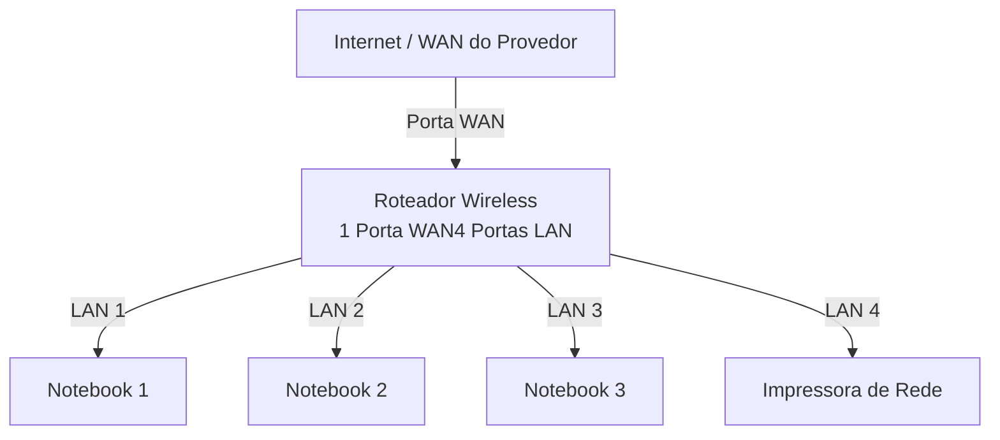
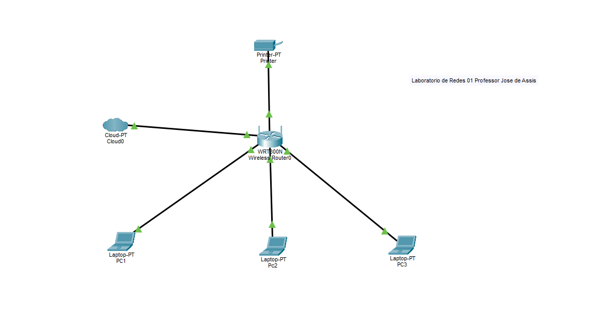

# lab-redes-01

Aluno: Alexandre Santos de Araujo

#Laboratório de redes 01 projeto de rede local

Data: 09/03/2026

---

##1. Objetivo
Implementar uma rede local simples conectando 3 notebooks a um roteador wireless com switch e um impressora de rede.

O projeto será dividido em duas etapas:

1. Simulação da rede no Cisco Packet Tracer
2. Implementação da rede no laborátorio real.

---

## 2. Equipamentos utilizados neste laboratorio:

- 3 notebooks
- 1 roteador wireless com 1 porta Wan e 4 portas Lan
- 1 impressora de rede
- cabos de rede

  ---

## 3. Topologia da rede 

Diagrama lógico da rede usada neste laborátorio

Imagem da topologia usada neste laborátorio

---

## 4. Plano de endereçamento de IP

Rede: 192.168.0.0/24

Gateway: 192.168.0.1

| Dispositivo | Tipo de IP | Endereço IP | Observação |
|-------------|-------------|-------------|-------------|
|Roteador | Estático | 192.168.0.1 | 192.168.0.104 | IP do Roteador |
|Impressora  Reserva DHCP | 192.168.0.104 | IP reservado pelo roteador |
|PC1| Reserva DHCP | 192.168.0.105| IP reservado pelo roteador |
|PC2| DHCP | Automático | IP atribuido pelo roteador |
|PC3 | DHCP| Automático | IP atribuido | IP atribuido ao roteador |

**Observação**

---

## 5. Implementação do laborátorio real

Após a instalação , a rede foi montada fisicamente no laboratório.

Etapas realizadas:

(fotos e capturas de tela realizadas durante o laboratorio)

Teste:

(fotos e capturas de tela realizadas durante o laboratório)

---

## 6. Conclusão 

Este laboratorio permitiu compreender o funcionamento de uma rede local simples, incluindo:
- Estrutura de uma rede doméstica ou de pequeno escritório
- Utilização de um roteador com uma porta WAN e portas LAN
- Funcionamento do DHCP
- Comunicação entre dispositivos na rede local
- Utilização de uma impressora de rede
- Compartilhamento de pastas na rede usando o Windows
- Jogos na rede

